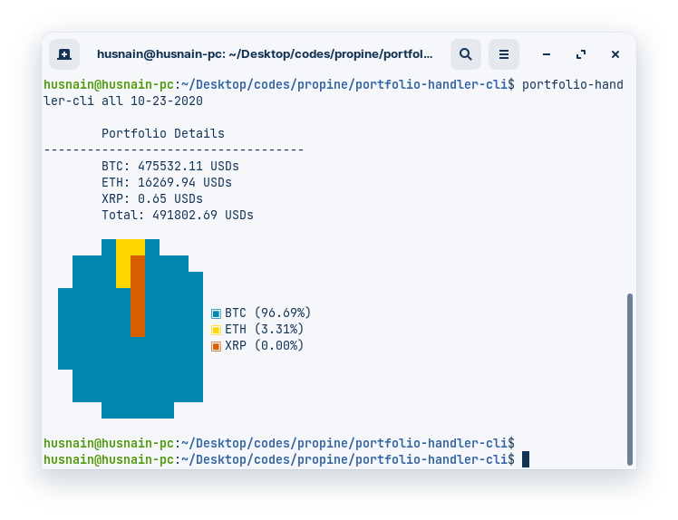

# Crypto Portfolio CLI
A CLI to check portfolio values with respect to given token symbol and date. 

## Task Instructions
### Question 1 - Programming
Let us assume you are a crypto investor. You have made transactions over a period of time which is logged in a [CSV file](https://s3-ap-southeast-1.amazonaws.com/static.propine.com/transactions.csv.zip). Write a command line program that does the following

 - Given no parameters, return the latest portfolio value per token in USD
 - Given a token, return the latest portfolio value for that token in USD
 - Given a date, return the portfolio value per token in USD on that date
 - Given a date and a token, return the portfolio value of that token in USD on that date

The CSV file has the following columns
 - timestamp: Integer number of seconds since the Epoch
 - transaction_type: Either a DEPOSIT or a WITHDRAWAL
 - token: The token symbol
 - amount: The amount transacted

Portfolio means the balance of the token where you need to add deposits and subtract withdrawals. You may obtain the exchange rates from [cryptocompare](https://min-api.cryptocompare.com/) where the API is free. You should write it in Node.js as our main stack is in Javascript/Typescript and we need to assess your proficiency.

## Solution
### Install
Running following commands in project directory: 

`npm install`

**Ubuntu:**

`sudo npm link`

**On Windows:**

`npm link`

### Usage
- `portfolio-handler-cli [token-name] date`
- `token-name` values:
    - all
    - BTC
    - ETH
    - XRP
- `date` format: MM-dd-yyyy
- Example: `portfolio-handler-cli all 10-23-2020`

    **Results:**

    

**Note:** running above command will take a lot of time because `.\data\transactions.csv` file is 977 MB. For quick testing and iteration, I stored 100 rows in another file named `transactions-chunk.csv`. Data file can be changed by updating the file name in `.\src\cli.js` file.

## Notes on Implementation
### About Code
Based on parameters, there are 3 cases to be handled in CLI:
1. date and token are provided
2. date provied
3. token provided
In the implemented solution, I have used only 1 reading stream and for each line reading, I determine case based off parameters. But, drawback is that if there are N transactions, we check that N times. We can check for cases outside reading stream to decrease run-time calculations by using multiple reading stream blocks. But, that will add to code duplication which makes maintaining the code difficult.

### Suggested Improvements
- **Searching by date:** `transactions.csv` file has size of 977 MB. I have implemented a linear search to filter transactions with date equal or lower than the parameter date. This has time complexity of `O(N)`. 
If we sort the rows in transactions file with respect to epoch, we can use binary search combined with random line access to find the last transaction whose details are needed. Then we can iterate till that transaction to find the portfolio dates. Steps required for this will reduce to: `log(N) + transaction_index`.
- **Calculating by Token without date**: to find portfolio details by one or all tokens, instead of going through whole 977MB file every time, we can simply find net values of all tokens (by adding all withdrawals and subtracting all deposits) and then fetch prices of each token to calculate portfolio details. This will require no iteration of the file.
What if transaction file keeps getting updated? Well, store the net results in a separate file, whenever transaction file changes, change the net results file as well.
- Using a database would've also helped because databases are optimized for such operations. Handling a `csv` file is difficult.
**Why these optimizations aren't implemented?**
It was explicitly stated to use the given transactions file. So, I did not alter it or convert it into a database.
- **A flaw in the current implementation:** When a user adds a date parameter, it'd have been suitable to return portfolio details according to token prices on that date instead of using latest price. But, the CryptoCompare API doesn't support the date parameter to fetch price details on a specific date. That's why this flaw exists.
